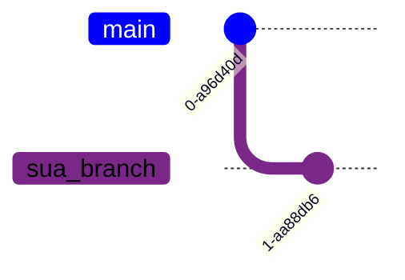
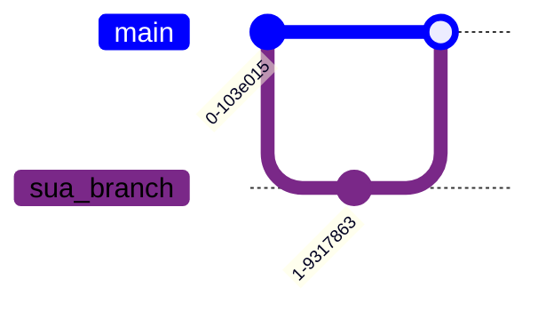

# GIT
O **GIT** é um sistema de controle de versão distribuído, que permite rastrear alterações no código fonte de um projeto. Com o **GIT** é possível trabalhar em equipe, pois ele permite que várias pessoas trabalhem no mesmo projeto ao mesmo tempo, sem que uma interfira no trabalho da outra.
## Sumário comandos
1. [Comandos GIT](#comandos-git)
    1. [Escolha as alterações a serem incluídas no próximo commit](#escolha-as-alterações-a-serem-incluídas-no-próximo-commit)
    2. [Verificar o status das alterações](#verificar-o-status-das-alterações)
    3. [Commit](#commit)
    4. [Enviar as alterações](#enviar-as-alterações)
    5. [Branchs](#branchs)
    6. [Merge](#merge)
    7. [Verificar se possui alterações no repositório remoto](#verificar-se-possui-alterações-no-repositório-remoto)
    8. [Puxar alterações](#puxar-alterações)
2. [Arquivos GIT](#arquivos-GIT)

# Comandos GIT

## Escolha as alterações a serem incluídas no próximo commit
1.Adicionar todas as alterações
```bash
git add .
```

* Adicionar um arquivo específico
    ```bash
    git add nome_do_arquivo
    ```
* Adicionar todos os arquivos de um diretório
    ```bash
    git add nome_do_diretorio/
    ```
* Adicionar todos os arquivos com uma extensão específica
    ```bash
    git add *.extensao
    ```
> Nota: É possivel "concatenar" os comandos acima, por exemplo:

```bash
git add nome_do_diretorio/ *.extensao
```


## Verificar o status das alterações
```bash
git status
```

## Commit
Commits são alterações feitas no código que são salvas no repositório local. Cada commit é uma alteração específica, com uma mensagem que descreve o que foi feito e possui um identificador único (**hash**).

```bash
git commit -m "Mensagem do commit"
```
O comando acima cria um commit com a mensagem "Mensagem do commit". O -m é um atalho para a flag --message.


## Enviar as alterações
1.Enviar as alterações para o repositório remot o (quando não se especifica o repositório remoto, o git envia para o repositório padrão)
```bash
git push
```
Consierando que normlmente os comandos vão ser feitas dentro do clone do repositório, o repositório padrão é o repositório de onde o clone foi feito. Agora se nesse repositorio existem varias branchs e você quer enviar para uma branch específica, você deve especificar o repositório remoto e a branch.

* Enviar as alterações para uma branch específica
    ```bash
    git push origin sua_branch
    ```

## Branchs
Branchs são ramificações do projeto, que permitem trabalhar em funcionalidades diferentes sem interferir no código principal. Quando você cria uma nova branch, você está criando uma cópia do código principal contendo todas as alterações (**commits**) feitas até o momento.

1.Criar uma nova branch da branch atual que você está
```bash
git checkout -b sua_branch
```


>Nota: Cada ponto representa um commit que possui seu **hash** único. 

Ao criar uma nova branch, é possível trabalhar em uma nova funcionalidade sem interferir no código principal. Após finalizar a funcionalidade normalmente é feito um commit e um merge com a branch principal.


* Criar uma branch a partir de uma branch existente
    ```bash
    git checkout -b sua_branch branch_origem
    ```
* Mudar de branch
    ```bash
    git checkout sua_branch
    ```
* Listar todas as branchs
    ```bash
    git branch
    ```
* Deletar uma branch
    ```bash
    git branch -d sua_branch
    ```

>Nota: Normalmente o git não configura as suas novas branchs criadas localmente para serem rastreadas por uma branch remota. Para configurar isso automaticamente, você pode usar o comando abaixo:

```bash
git config --global --add --bool push.autoSetupRemote true
```

## Merge 
O comando **merge** é utilizado para unir duas branchs. O merge é feito na branch atual.

1.Merge de uma branch com a branch atual

```bash
git merge sua_branch
```



## Verificar se possui alterações no repositório remoto
O comando **fetch** baixa as alterações do repositório remoto para o repositório local, mas não faz merge com a branch atual.
```bash
git fetch
```

## Puxar alterações
O comando **pull** baixa as alterações do repositório remoto e faz merge com a branch atual.

1.Puxar alterações do repositório remoto
```bash
git pull
```
* Puxar alterações de uma branch específica
    ```bash
    git pull origin sua_branch
    ```

## Voltar para um commit anterior
Vamos supor você fez uma serie de commits e quer voltar atras em um commit específico. Para isso temos uma comando que faz sua branch voltar a um commit específico.
1. Primeiro temos que listar todos os commits para sabermos qual commit devemos voltar
    ```bash
    git log --all
    ```
    ou o comando abaixo para observamos em formato de grafo
    ```bash
    git log --all --graph 
    ```
2. Depois de identificar o commit que queremos voltar, vamos usar o comando abaixo
    ```bash
    git checkout hash_do_commit
    ``` 

# Arquivos GIT


